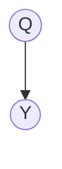
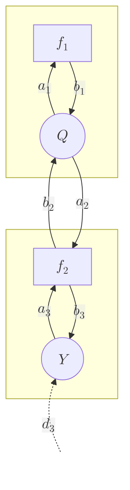
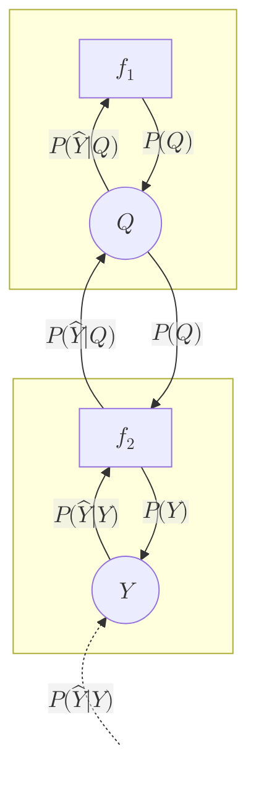
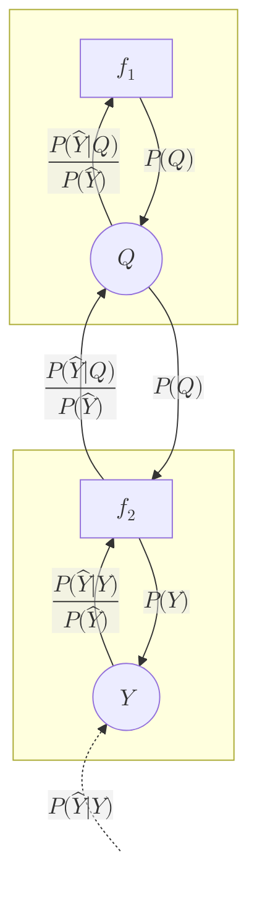

[TOC]

# Simple example Bayesian network

Consider a simple Bayesian network, in which there is one hidden variable $Q$ and one observed variable $Y$.



Then the complete probability distribution over all variables can be factorized as follows:

```math
P(Q, Y) = P(Q)P(Y|Q)
```

Suppose the network has the following parameters.

$P(Q)$ is described by a two-label conditional probability table (CPT):

| q   | P(Q = q) |
| --- | -------- |
| 0   | 0.4      |
| 1   | 0.6      |

$P(Y|Q)$ is described by a CPT where $Y$ takes on three possible values:

| y   | P(Y = y &#124; Q = 0) | P(Y = y &#124; Q = 1) |
| --- | --------------------- | --------------------- |
| 0   | 0.1                   | 0.5                   |
| 1   | 0.6                   | 0.1                   |
| 2   | 0.3                   | 0.4                   |

## Naive inference

Now let's perform inference on the hidden variable $Q$ for each of the three possible observations.

The posterior distribution is calculated as:

```math

P(Q|Y) = \frac{P(Y|Q)P(Q)}{P(Y)} = \frac{P(Y|Q)P(Q)}{\sum\limits_{q}{P(Y|Q)P(Q)}}

```

### Python example
```python
import numpy as np

# Define CPTs
P_Q = np.array([0.4, 0.6])
P_YxQ = np.array([[0.1, 0.6, 0.3], [0.5, 0.1, 0.4]])

# Calculate unnormalized
P_QxY = (P_YxQ * P_Q[:, None]).T

# Normalize
P_Y = P_QxY.sum(axis=1)
P_QxY /= P_Y[:, None]

# Print
P_QxY
```

Output:
```
array([[0.11764706, 0.88235294],
       [0.8       , 0.2       ],
       [0.33333333, 0.66666667]])
```

## Sum-product algorithm

### Factor graph representation

A Bayesian network can be converted into a factor graph representation as follows:
1. For each node in the Bayesian network, place one corresponding *variable node*.
2. For each probability distribution associated with the nodes, place one corresponding *factor node*.
3. For each factor node, draw links to and from all variable nodes that are included in its probability distribution.
4. Draw one evidence link into each observed variable node.

For example, for the above network:
1. Place one variable node for $Q$ and one for $Y$.
2. There are two probability distributions, namely $P(Q)$ and $P(Y|Q)$. For each, place the corresponding factor nodes $f_1$ and $f_2$.
3. First consider the factor node $f_1$. Its corresponding distribution $P(Q)$ only takes $Q$ as an input. Hence place links to and from the corresponding variable node for $Q$ ($a_1$ and $b_1$). Then consider the factor node $f_2$, with corresponding probability distribution $P(Y|Q)$. This distribution takes both $Q$ and $Y$ as inputs, so draw links to and from to those two variable nodes ($b_2$ and $a_2$, $a_3$ and $b_3$).
4. Finally, draw an evidence link into the observed variable node $Y$.



Note that each link going into a factor node is labeled $a$ and each link going into a variable node is labeled $b$. The evidence links are labeled with the letter $d$.

Furthermore, note that by the above procedure there is always one and exactly one variable node and factor node for each node in the original Bayesian network. These two may be considered each other's *local* factor/variable node. For example, factor node $f_1$ is variable node $Q$'s local factor node and, vice versa, $Q$ is $f_1$'s local variable node. Furthermore, their links can be called *local* links. Thus, $a_1$ and $b_1$ are local links. Conversely, links between nodes stemming from different nodes in the original Bayesian network may be called *remote* links. For example, $a_2$ and $b_2$ are remote links.

Using the factor graph, the complete probability distribution is calculated as the product of the factor nodes:

```math
P(Q, Y) = f_1(q)f_2(q, y)
```

where

```math
f_1(q) = P(Q) \\
f_2(q, y) = P(Y|Q)
```

### Message definitions

```math

\begin{align}

d_3(y) & = 
    P(\hat{Y}|Y)
    \qquad \qquad \qquad \qquad \qquad \qquad \qquad 
    & \begin{cases}
        1 & \text{if } y = \hat{y} \\
        0 & \text{if } y \ne \hat{y} \\
    \end{cases} \\
a_3(y) & = 
    d_3(y)
    & P(\hat{Y}|Y) \\
b_3(y) & =
    \sum_{q}{f_2(q, y)a_2(q)} 
    = \sum_{q}{P(Y|Q)P(Q)}
    & P(Y) \\
b_2(q) & =
    \sum_{q}{f_2(q, y)a_3(q)} 
    = \sum_{q}{P(Y|Q)P(\hat{Y}|Y)}
    & P(\hat{Y}|Q) \\
a_2(q) & = 
    b_1(q)
    & P(Q) \\
a_1(q) & = 
    b_2(q)
    & P(\hat{Y}|Q) \\
b_1(q) & = 
    f_1(q)
    & P(Q) \\
        

\end{align}

```

Plotted on the graph:



### Inference

Since most messages depend on other message, a number of iterations is needed to calculate the final values for all messages (in this case 4 iterations: $d_3$→$a_3$→$b_2$→$a_2$→$b_3$).

After that, the messages can be used to perform inference on the hidden variable $Q$:

```math

a_1(q)b_1(q) = P(\hat{Y}|Q)P(Q)

```

Normalizing yields the posterior distribution for $Q$:

```math

P(Q|\hat{Y}) = \frac{P(\hat{Y}|Q)P(Q)}{P(\hat{Y})} 
     = \frac{P(\hat{Y}|Q)P(Q)}{\sum\limits_{q}{P(\hat{Y}|Q)P(Q)}} 
    =  \frac{a_1(q)b_1(q)}{\sum\limits_{q}{a_1(q)b_1(q)}}

```

### Python example

```python
P_QxY = np.zeros((3, 2))

# For each possible input value
for Y_hat in [0, 1, 2]:
    # Messages upwards
    d3 = (np.arange(3) == Y_hat).astype(float)
    a3 = d3
    b2 = (P_YxQ * a3[None, :]).sum(axis=1)
    a1 = b2

    # Messages downwards
    b1 = P_Q
    a2 = b1
    b3 = (P_YxQ * a2[:, None]).sum(axis=0)
    
    # Calculate P_Q
    P_QxY[Y_hat, :] = a1 * b1 / (a1 * b1).sum()
    
P_QxY
```

Output:
```
array([[0.11764706, 0.88235294],
       [0.8       , 0.2       ],
       [0.33333333, 0.66666667]])
```

These values match with the ones calculated naively, showing the correctness of the algorithm.

## Modified sum-product algorithm

A downside of the sum-product algorithm is that the messages tend to vanish towards zero over iterations, especially when the network contains loops. This can be remedied by normalizing the messages at each iteration. In addition, this modification gives the messages simpler interpretations.

The modification goes as follows:
- Only messages coming from a variable node are modified (i.e. $a$'s)
- When it's a message going to the node's local factor node: the normalization factor is the product of **all** incoming messages to variable node (i.e. $b$'s).
- When it's a message going to a remote factor node: the normalization factor is the product of all incoming messages **except** for the one coming from that factor node.

### Factor graph representation

The factor graph representation is the same:


### Message definitions

However, the message definitions are modified to include a normalization.

```math

\begin{align}

d_3(y) & = 
    \begin{cases}
        1 & \text{if } y = \hat{y} \\
        0 & \text{if } y \ne \hat{y} \\
    \end{cases}
    \qquad \qquad \qquad \qquad \qquad \qquad \qquad 
    & P(\hat{Y}|Y) \\
c_3 & =
    \sum_{y}{b_3(y)d_3(y)} 
    = \sum_{y}{P(Y)P(\hat{Y}|Y)}
    & P(\hat{Y}) \\
a_3(y) & = 
    \frac{d_3(y)}{c_3}
    & \frac{P(\hat{Y}|Y)}{P(\hat{Y})} \\
b_3(y) & =
    \sum_{q}{f_2(q, y)a_2(q)} 
    = \sum_{q}{P(Y|Q)P(Q)}
    & P(Y) \\
c_2 & =
    \sum_{q}{b_1(q)} 
    = \sum_{q}{P(Q)}
    & 1 \\    
b_2(q) & =
    \sum_{q}{f_2(q, y)a_3(q)} 
    = \sum_{q}{P(Y|Q)\frac{P(\hat{Y}|Y)}{P(\hat{Y})}}
    & \frac{P(\hat{Y}|Q)}{P(\hat{Y})} \\
a_2(q) & = 
    \frac{b_1(q)}{c_2}
    = \frac{P(Q)}{1}
    & P(Q) \\
c_1 & =
    \sum_{q}{b_1(q)b_2(q)} 
    = \sum_{q}{P(Q)\frac{P(\hat{Y}|Q)}{P(\hat{Y})}}
    = \sum_{q}{P(Q|\hat{Y})}
    & 1 \\    
a_1(q) & = 
    \frac{b_2(q)}{c_1}
    = \frac{P(\hat{Y}|Q)}{P(\hat{Y})}\frac{1}{c_1}
    & \frac{P(\hat{Y}|Q)}{P(\hat{Y})} \\
b_1(q) & = 
    f_1(q)
    & P(Q) \\
        

\end{align}

```

Plotted on the graph:



### Inference

Now inference can be done for the hidden variable $Q$ without any further normalization, by simply multiplying the two local messages between the variable and factor node beloning to $Q$:

```math

P(Q|\hat{Y}) = \frac{P(\hat{Y}|Q)}{P(\hat{Y})}P(Q)
    =  a_1(q)b_1(q)

```

Note that, because of the normalization, all messages are coupled. Therefore we now need a larger number of iterations, because a single sweep up and back down doesn't suffice anymore.

### Python example

```python
import numpy as np

# Define CPTs
P_Q = np.array([0.4, 0.6])
P_YxQ = np.array([[0.1, 0.6, 0.3], [0.5, 0.1, 0.4]])

# Perform inference
P_QxY = np.zeros((3, 2))

# For each possible input value
for Y_hat in [0, 1, 2]:
    # Iterate a number of times
    for i in range(4):
        # Initialize messages
        d3 = (np.arange(3) == Y_hat).astype(float)
        a3 = np.ones((3))/3
        b3 = np.ones((3))/3
        b2 = np.ones((2))/2
        a2 = np.ones((2))/2
        a1 = np.ones((2))/2
        b1 = P_Q        
        
        # Calculate messages across entire graph
        c3 = (b3*d3).sum()
        a3 = d3/c3
        b3 = (P_YxQ * a2[:, None]).sum(axis=0)
        
        c2 = b1.sum()
        b2 = (P_YxQ * a3[None, :]).sum(axis=1)
        a2 = b1/c2
        
        c1 = (b1*b2).sum()
        a1 = b2/c1
        b1 = P_Q
        
    # Calculate P_Q
    P_QxY[Y_hat, :] = a1 * b1 / (a1 * b1).sum()
    
P_QxY

```

Output:
```
array([[0.11764706, 0.88235294],
       [0.8       , 0.2       ],
       [0.33333333, 0.66666667]])
```

These match with the unmodified algorithm.