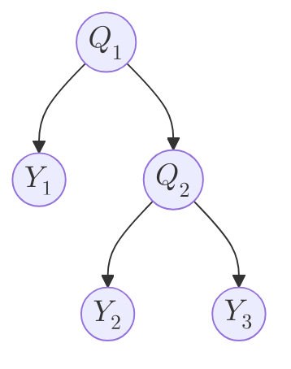
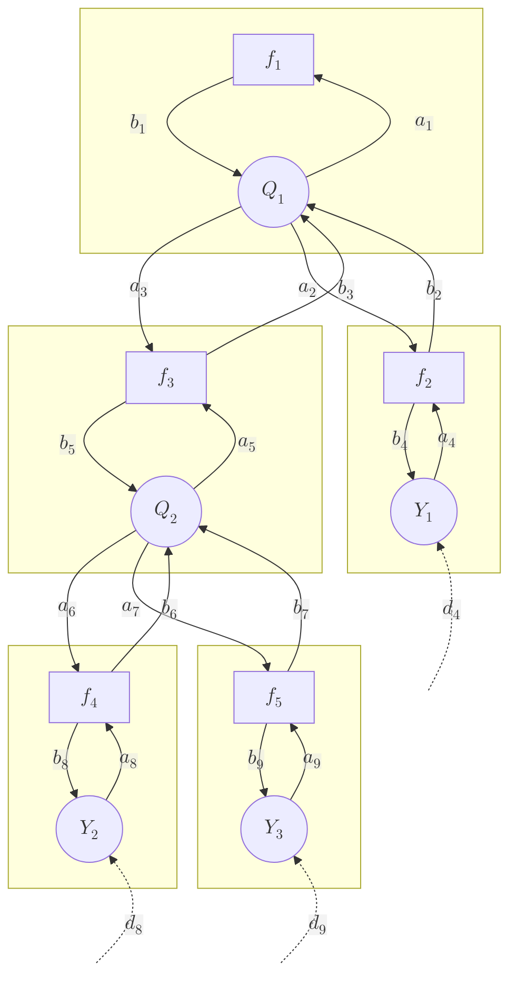
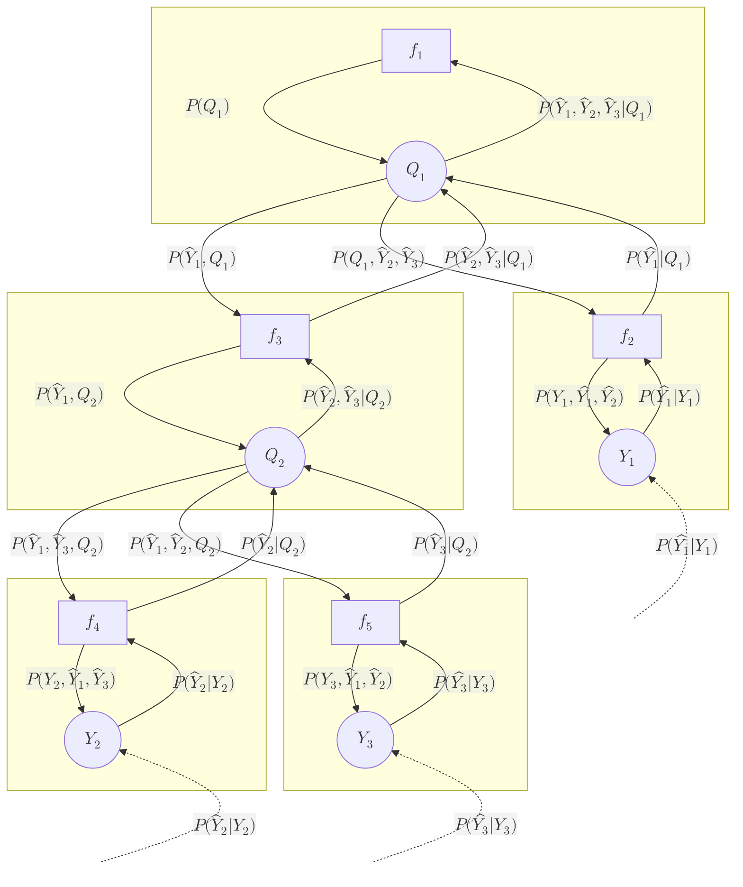

[TOC]

# Complex Bayesian Network example

A more complex Bayesian network is given as follows:



## Naive inference

The simplest way to perform the posterior distributions $P(Q_1|Y_1,Y_2,Y_3)$ and $P(Q_2|Y_1,Y_2,Y_3)$ is to first calculate the complete joint probability distribution and marginalize and normalize appropriately.

The complete joint probability distribution is given by:

```math

P(Q_1,Q_2,Y_1,Y_2,Y_3) = P(Q_1)P(Y_1|Q_1)P(Q_2|Q_1)P(Y_2|Q_2)P(Y_3|Q_2)

```

Then:

```math

P(Q_1|Y_1,Y_2,Y_3) = \frac{\sum\limits_{q_2}{P(Q_1,Q_2,Y_1,Y_2,Y_3)}}{\sum\limits_{q_1}\sum\limits_{q_2}{P(Q_1,Q_2,Y_1,Y_2,Y_3)}}

\\

P(Q_2|Y_1,Y_2,Y_3) = \frac{\sum\limits_{q_1}{P(Q_1,Q_2,Y_1,Y_2,Y_3)}}{\sum\limits_{q_1}\sum\limits_{q_2}{P(Q_1,Q_2,Y_1,Y_2,Y_3)}}

```

### Python example
```python
import numpy as np

# Define CPTs
P_Q1 = np.array([0.4, 0.6])
P_Q2xQ1 = np.array([[0.3, 0.7], [0.2, 0.8]])
P_Y1xQ1 = np.array([[0.1, 0.6, 0.3], [0.5, 0.1, 0.4]])
P_Y2xQ2 = np.array([[0.5, 0.3, 0.2], [0.4, 0.2, 0.4]])
P_Y3xQ2 = np.array([[0.4, 0.6], [0.9, 0.1]])

# Define evidence
Y1_hat = np.array([0, 1, 0])
Y2_hat = np.array([0, 0, 1])
Y3_hat = np.array([1, 0])

# Calculate complete probability distribution
# [Q1, Q2, Y1, Y2, Y2]
P = P_Q1[:, None, None, None, None] \
    * P_Q2xQ1[:, :, None, None, None] \
    * P_Y1xQ1[:, None, :, None, None] \
    * P_Y2xQ2[None, :, None, :, None] \
    * P_Y3xQ2[None, :, None, None, :]

# Enter evidence my multiplying
P = P \
    * Y1_hat[None, None, :, None, None] \
    * Y2_hat[None, None, None, :, None] \
    * Y3_hat[None, None, None, None, :]

# Marginalize, unnormalized
P_Q1xY1_Y2_Y3 = P.sum(axis=(1, 2, 3, 4))
P_Q2xY1_Y2_Y3 = P.sum(axis=(0, 2, 3, 4))

# Normalize
P_Q1xY1_Y2_Y3 = P_Q1xY1_Y2_Y3 / P_Q1xY1_Y2_Y3.sum()
P_Q2xY1_Y2_Y3 = P_Q2xY1_Y2_Y3 / P_Q2xY1_Y2_Y3.sum()

# Print
print(P_Q1xY1_Y2_Y3)
print(P_Q2xY1_Y2_Y3)
```

Output:
```
[0.78409091 0.21590909]
[0.07954545 0.92045455]
```

## Sum-product algorithm

### Factor graph representation



### Message definitions

```math

\begin{align}

d_8(y_2) & = 
    \begin{cases}
        1 & \text{if } y_2 = \hat{y}_2 \\
        0 & \text{if } y_2 \ne \hat{y}_2 \\
    \end{cases}
    \qquad \qquad \qquad \qquad \qquad \qquad \qquad \qquad \qquad \qquad \qquad 
    & P(\hat{Y}_2|Y_2) \\

a_8(y_2) & = 
    d_8(y_2)
    & P(\hat{Y}_2|Y_2) \\

b_8(y_2) & =
    \sum_{q_2}{f_4(q_2, y_2)a_6(q_2)}
    = \sum_{q_2}{P(Y_2|Q_2)P(\hat{Y}_1,\hat{Y}_3,Q_2)}
    & P(Y_2, \hat{Y}_1,\hat{Y}_3) \\

b_6(y_2) & =
    \sum_{y_2}{f_4(y_2, q_2)a_8(y_2)}
    \sum_{y_2}{P(Y_2|Q_2)P(\hat{Y}_2|Y_2)}
    & P(\hat{Y}_2|Q_2) \\

a_6(q_2) & = 
    b_5(q_2)b_7(q_2)
    = P(\hat{Y}_1,Q_2)P(\hat{Y}_3|Q_2)
    & P(\hat{Y}_1,\hat{Y}_3,Q_2) \\

d_9(y_3) & = 
    \begin{cases}
        1 & \text{if } y_3 = \hat{y_3} \\
        0 & \text{if } y_3 \ne \hat{y_3} \\
    \end{cases}
    & P(\hat{Y_3}|Y_3) \\

a_9(y_3) & = 
    d_9(y_3)
    & P(\hat{Y_3}|Y_3) \\
    
b_9(y_3) & =
    \sum_{q_2}{f_5(q_2, y_3)a_7(q_2)}
    = \sum_{q_2}{P(Y_3|Q_2)P(\hat{Y}_1,\hat{Y}_2,Q_2)}
    & P(Y_3, \hat{Y}_1,\hat{Y}_2) \\

a_7(q_2) & = 
    b_5(q_2)b_6(q_2)
    = P(\hat{Y}_1,Q_2)P(\hat{Y}_2|Q_2)
    & P(\hat{Y}_1,\hat{Y}_2,Q_2) \\

b_7(y_3) & =
    \sum_{y_3}{f_5(y_3, q_2)a_9(y_3)}
    \sum_{y_3}{P(Y_3|Q_2)P(\hat{Y}_3|Y_3)}
    & P(\hat{Y}_3|Q_2) \\

a_5(q_2) & = 
    b_6(q_2)b_7(q_2)
    = P(\hat{Y}_2|Q_2)P(\hat{Y}_3|Q_2)
    & P(\hat{Y}_2,\hat{Y}_3|Q_2) \\

b_5(q_2) & =
    \sum_{q_1}{f_3(q_1, q_2)a_3(q_1)} 
    = \sum_{q_1}P(Q_2|Q_1)P(\hat{Y}_1, Q_1)
    & P(\hat{Y}_1, Q_2) \\

a_3(q_2) & = 
    b_1(q_1)b_2(q_1) 
    = P(Q_1)P(\hat{Y}_1|Q_1)
    & P(\hat{Y}_1, Q_1) \\

b_3(q_1) & =
    \sum_{q_2}{f_3(q_1, q_2)a_5(q_2)}
    = \sum_{q_2}{P(Q_2|Q_1)P(\hat{Y}_2,\hat{Y}_3|Q_2)} 
    & P(\hat{Y}_2,\hat{Y}_3|Q_1) \\

d_4(y_1) & = 
    \begin{cases}
        1 & \text{if } y_1 = \hat{y_1} \\
        0 & \text{if } y_1 \ne \hat{y_1} \\
    \end{cases}
    & P(\hat{Y_1}|Y_1) \\
        
a_4(y_1) & = 
    d_4(y)
    & P(\hat{Y_1}|Y_1) \\
    
b_4(y_1) & =
    \sum_{q_1}{f_2(q_1, y_1)a_2(q_1)} 
    = \sum_{q_1}{P(Y_1|Q_1)P(\hat{Y}_1,\hat{Y}_2,Q_1)} 
    & P(Y_1,\hat{Y_1},\hat{Y_2}) \\
    
b_2(q_1) & =
    \sum_{y_1}{f_2(q_1, y_1)a_4(q_1)}
    = \sum_{y_1}{P(Y_1|Q_1)P(\hat{Y_1}|Y_1)} 
    & P(\hat{Y_1}|Q_1) \\

a_2(q_1) & = 
    b_1(q_1)b_3(q_1)
    = P(Q_1)P(\hat{Y}_2,\hat{Y}_3|Q_1)
    & P(Q_1,\hat{Y}_2,\hat{Y}_3) \\
    
a_1(q_1) & = 
    b_2(q_1)b_3(q_1)
    = P(\hat{Y_1}|Q_1)P(\hat{Y}_2,\hat{Y}_3|Q_1)
    & P(\hat{Y}_1,\hat{Y}_2,\hat{Y}_3|Q_1) \\
    
b_1(q_1) & = 
    f_1(q_1)
    & P(Q_1) \\
        

\end{align}

```

Plotted on the graph:



### Inference

```math

\begin{align}

P(Q_1|\hat{Y}_1,\hat{Y}_2,\hat{Y}_3) 
    = & \frac{P(\hat{Y}_1,\hat{Y}_2,\hat{Y}_3|Q_1)P(Q_1)}{P(\hat{Y}_1,\hat{Y}_2,\hat{Y}_3)} \\
    = & \frac{P(\hat{Y}_1,\hat{Y}_2,\hat{Y}_3|Q_1)P(Q_1)}{\sum\limits_{q_1}{P(\hat{Y}_1,\hat{Y}_2,\hat{Y}_3|Q_1)P(Q_1)}} \\
    = & \frac{a_1(q_1)b_1(q_1)}{\sum\limits_{q_1}{a_1(q_1)b_1(q_1)}} \\

P(Q_2|\hat{Y}_1,\hat{Y}_2,\hat{Y}_3) 
    = & \frac{P(\hat{Y}_1,\hat{Y}_2,\hat{Y}_3|Q_2)P(Q_2)}{P(\hat{Y}_1,\hat{Y}_2,\hat{Y}_3)}  \\
    = & \frac{P(\hat{Y}_1,\hat{Y}_2,\hat{Y}_3,Q_2)}{\sum\limits_{q_2}{P(\hat{Y}_1,\hat{Y}_2,\hat{Y}_3,Q_2)}}  \\
    = & \frac{P(\hat{Y}_2,\hat{Y}_3|Q_2)P(\hat{Y}_1, Q_2)}{\sum\limits_{q_2}P(\hat{Y}_2,\hat{Y}_3|Q_2)P(\hat{Y}_1, Q_2)} \\
    = & \frac{a_5(q_2)b_5(q_2)}{\sum\limits_{q_2}{a_5(q_2)b_5(q_2)}} \\
    
\end{align}

```

### Python example

```python
import numpy as np

# Define CPTs
P_Q1 = np.array([0.4, 0.6])
P_Q2xQ1 = np.array([[0.3, 0.7], [0.2, 0.8]])
P_Y1xQ1 = np.array([[0.1, 0.6, 0.3], [0.5, 0.1, 0.4]])
P_Y2xQ2 = np.array([[0.5, 0.3, 0.2], [0.4, 0.2, 0.4]])
P_Y3xQ2 = np.array([[0.4, 0.6], [0.9, 0.1]])

# Define evidence
Y1_hat = np.array([0, 1, 0])
Y2_hat = np.array([0, 0, 1])
Y3_hat = np.array([1, 0])

# Calculate upwards messages
d8 = Y2_hat
a8 = d8
b6 = (a8[None, :]*P_Y2xQ2).sum(axis=1)

d9 = Y3_hat
a9 = d9
b7 = (a9[None, :]*P_Y3xQ2).sum(axis=1)

a5 = b6*b7
b3 = (a5[None, :]*P_Q2xQ1).sum(axis=1)

d4 = Y1_hat
a4 = d4
b2 = (a4[None, :]*P_Y1xQ1).sum(axis=1)

a1 = b2*b3

# Calculate downwards messages
b1 = P_Q1

a2 = b1*b3
b4 = (a2[:, None] * P_Y1xQ1).sum(axis=0)

a3 = b1*b2
b5 = (a3[:, None] * P_Q2xQ1).sum(axis=0)

a6 = b5*b7
b8 = (a6[:, None] * P_Y2xQ2).sum(axis=0)

a7 = b5*b6
b7 = (a7[:, None] * P_Y3xQ2).sum(axis=0)

# Inference
P_Q1xY1_Y2_Y3 = a1*b1
P_Q1xY1_Y2_Y3 = P_Q1xY1_Y2_Y3 / P_Q1xY1_Y2_Y3.sum()

P_Q2xY1_Y2_Y3 = a5*b5
P_Q2xY1_Y2_Y3 = P_Q2xY1_Y2_Y3 / P_Q2xY1_Y2_Y3.sum()

# Print
print(P_Q1xY1_Y2_Y3)
print(P_Q2xY1_Y2_Y3)
```

Output:
```
[0.78409091 0.21590909]
[0.07954545 0.92045455]
```

## Modified sum-product algorithm

### Factor graph representation

The factor graph representation is the same:


### Message definitions

```math

\begin{align*}

d_8(y_2) & = 
    \begin{cases}
        1 & \text{if } y_2 = \hat{y}_2 \\
        0 & \text{if } y_2 \ne \hat{y}_2 \\
    \end{cases}
    & P(\hat{Y}_2|Y_2) \\

c_8 & =
    \sum_{y_2}{b_8(y_2)d_8(y_2)}
    = \sum_{y_2}{P(Y_2|\hat{Y}_3,\hat{Y}_1)P(\hat{Y}_2|Y_2)}
    & P(\hat{Y}_2|\hat{Y}_3,\hat{Y}_1) \\
    
a_8(y_2) & = 
    \frac{d_8(y_2)}{c_8}
    & \frac{P(\hat{Y}_2|Y_2)}{P(\hat{Y}_2|\hat{Y}_3,\hat{Y}_1)} \\

b_8(y_2) & =
    \sum_{q_2}{f_4(q_2, y_2)a_6(q_2)}
    = \sum_{q_2}{P(Y_2|Q_2)P(Q_2|\hat{Y}_3,\hat{Y}_1)}
    & P(Y_2|\hat{Y}_3,\hat{Y}_1) \\

c_6 & =
    \sum_{q_2}{b_5(q_2)b_7(q_2)}
    = \sum_{q_2}{P(Q_2|\hat{Y}_1)\frac{P(\hat{Y}_3|Q_2)}{P(\hat{Y}_3|\hat{Y}_2,\hat{Y}_1)}}
    & \frac{P(\hat{Y}_3|\hat{Y}_1)}{P(\hat{Y}_3|\hat{Y}_2,\hat{Y}_1)} \\

b_6(y_2) & =
    \sum_{y_2}{f_4(y_2, q_2)a_8(y_2)}
    = \frac{\sum_{y_2}{P(Y_2|Q_2)P(\hat{Y}_2|Y_2)}}{P(\hat{Y}_2|\hat{Y}_3,\hat{Y}_1}
    & \frac{P(\hat{Y}_2|Q_2)}{P(\hat{Y}_2|\hat{Y}_3,\hat{Y}_1)} \\

a_6(q_2) & = 
    \frac{b_5(q_2)b_7(q_2)}{c_6}
    = P(Q_2|\hat{Y}_1)\frac{P(\hat{Y}_3|Q_2)}{P(\hat{Y}_3|\hat{Y}_2,\hat{Y}_1)}\frac{P(\hat{Y}_3|\hat{Y}_2,\hat{Y}_1)}{P(\hat{Y}_3|\hat{Y}_1)}
    & P(Q_2|\hat{Y}_1,\hat{Y}_3) \\

d_9(y_3) & = 
    \begin{cases}
        1 & \text{if } y_3 = \hat{y}_3 \\
        0 & \text{if } y_3 \ne \hat{y}_3 \\
    \end{cases}
    & P(\hat{Y}_3|Y_3) \\

c_9 & =
    \sum_{y_3}{b_9(y_3)d_9(y_3)}
    = \sum_{y_3}{P(Y_3|\hat{Y}_2,\hat{Y}_1)P(\hat{Y}_3|Y_3)}
    & P(\hat{Y}_3|\hat{Y}_2,\hat{Y}_1) \\

a_9(y_3) & = 
    \frac{d_9(y_3)}{c_9}
    & \frac{P(\hat{Y}_3|Y_3)}{P(\hat{Y}_3|\hat{Y}_2,\hat{Y}_1)} \\
    
b_9(y_3) & =
    \sum_{q_2}{f_5(q_2, y_3)a_7(q_2)}
    = \sum_{q_2}{P(Y_3|Q_2)P(Q_2|\hat{Y}_2,\hat{Y}_1)}
    & P(Y_3|\hat{Y}_2,\hat{Y}_1) \\

c_7 & =
    \sum_{q_2}{b_5(q_2)b_6(q_2)}
    = \sum_{q_2}{P(Q_2|\hat{Y}_1)\frac{P(\hat{Y}_2|Q_2)}{P(\hat{Y}_2|\hat{Y}_3,\hat{Y}_1)}}
    & \frac{P(\hat{Y}_2|\hat{Y}_1)}{P(\hat{Y}_2|\hat{Y}_3,\hat{Y}_1)} \\

a_7(q_2) & = 
    \frac{b_5(q_2)b_6(q_2)}{c_7}
    = P(Q_2|\hat{Y}_1)\frac{P(\hat{Y}_2|Q_2)}{P(\hat{Y}_2|\hat{Y}_3,\hat{Y}_1)}\frac{P(\hat{Y}_2|\hat{Y}_3,\hat{Y}_1)}{P(\hat{Y}_2|\hat{Y}_1)}
    & P(Q_2|\hat{Y}_1,\hat{Y}_2) \\

b_7(y_3) & =
    \sum_{y_3}{f_5(y_3, q_2)a_9(y_3)}
    = \frac{\sum_{y_3}{P(Y_3|Q_2)P(\hat{Y}_3|Y_3)}}{P(\hat{Y}_3|\hat{Y}_2,\hat{Y}_1}
    & \frac{P(\hat{Y}_3|Q_2)}{P(\hat{Y}_3|\hat{Y}_2,\hat{Y}_1)} \\

c_5 & =
    \sum_{q_2}{b_5(q_2)b_6(q_2)b_7(q_2)}
    = \sum_{q_2}{P(Q_2|\hat{Y}_1)\frac{P(\hat{Y}_2|Q_2)}{P(\hat{Y}_2|\hat{Y}_3,\hat{Y}_1)}\frac{P(\hat{Y}_3|Q_2)}{P(\hat{Y}_3|\hat{Y}_2,\hat{Y}_1)}}
    & \frac{P(\hat{Y}_2,\hat{Y}_3|\hat{Y}_1)}{P(\hat{Y}_2|\hat{Y}_3,\hat{Y}_1)P(\hat{Y}_3|\hat{Y}_2,\hat{Y}_1)} \\

a_5(q_2) & = 
    \frac{b_6(q_2)b_7(q_2)}{c_5}
    = \frac{P(\hat{Y}_2|Q_2)}{P(\hat{Y}_2|\hat{Y}_3,\hat{Y}_1)}\frac{P(\hat{Y}_3|Q_2)}{P(\hat{Y}_3|\hat{Y}_2,\hat{Y}_1)}    
    \frac{P(\hat{Y}_2|\hat{Y}_3,\hat{Y}_1)P(\hat{Y}_3|\hat{Y}_2,\hat{Y}_1)}{P(\hat{Y}_2,\hat{Y}_3|\hat{Y}_1)}
    & \frac{P(\hat{Y}_2,\hat{Y}_3|Q_2)}{P(\hat{Y}_2,\hat{Y}_3|\hat{Y}_1)} \\


HIER WAS IK GEBLEVEN

b_5(q_2) & =
    \sum_{q_1}{f_3(q_1, q_2)a_3(q_1)} 
    = \sum_{q_1}P(Q_2|Q_1)P(\hat{Y}_1, Q_1)
    & P(\hat{Y}_1, Q_2) \\

a_3(q_2) & = 
    b_1(q_1)b_2(q_1) 
    = P(Q_1)P(\hat{Y}_1|Q_1)
    & P(\hat{Y}_1, Q_1) \\

b_3(q_1) & =
    \sum_{q_2}{f_3(q_1, q_2)a_5(q_2)}
    = \sum_{q_2}{P(Q_2|Q_1)P(\hat{Y}_2,\hat{Y}_3|Q_2)} 
    & P(\hat{Y}_2,\hat{Y}_3|Q_1) \\

d_4(y_1) & = 
    \begin{cases}
        1 & \text{if } y_1 = \hat{y_1} \\
        0 & \text{if } y_1 \ne \hat{y_1} \\
    \end{cases}
    & P(\hat{Y_1}|Y_1) \\
        
a_4(y_1) & = 
    d_4(y)
    & P(\hat{Y_1}|Y_1) \\
    
b_4(y_1) & =
    \sum_{q_1}{f_2(q_1, y_1)a_2(q_1)} 
    = \sum_{q_1}{P(Y_1|Q_1)P(\hat{Y}_1,\hat{Y}_2,Q_1)} 
    & P(Y_1,\hat{Y_1},\hat{Y_2}) \\
    
b_2(q_1) & =
    \sum_{y_1}{f_2(q_1, y_1)a_4(q_1)}
    = \sum_{y_1}{P(Y_1|Q_1)P(\hat{Y_1}|Y_1)} 
    & P(\hat{Y_1}|Q_1) \\

a_2(q_1) & = 
    b_1(q_1)b_3(q_1)
    = P(Q_1)P(\hat{Y}_2,\hat{Y}_3|Q_1)
    & P(Q_1,\hat{Y}_2,\hat{Y}_3) \\
    
a_1(q_1) & = 
    b_2(q_1)b_3(q_1)
    = P(\hat{Y_1}|Q_1)P(\hat{Y}_2,\hat{Y}_3|Q_1)
    & P(\hat{Y}_1,\hat{Y}_2,\hat{Y}_3|Q_1) \\
    
b_1(q_1) & = 
    f_1(q_1)
    & P(Q_1) \\
        

\end{align*}

```

Plotted on the graph:


### Inference

```math

\begin{align}

P(Q_1|\hat{Y}_1,\hat{Y}_2,\hat{Y}_3) 
    = & \frac{P(\hat{Y}_1,\hat{Y}_2,\hat{Y}_3|Q_1)P(Q_1)}{P(\hat{Y}_1,\hat{Y}_2,\hat{Y}_3)} \\
    = & \frac{P(\hat{Y}_1,\hat{Y}_2,\hat{Y}_3|Q_1)P(Q_1)}{\sum\limits_{q_1}{P(\hat{Y}_1,\hat{Y}_2,\hat{Y}_3|Q_1)P(Q_1)}} \\
    = & \frac{a_1(q_1)b_1(q_1)}{\sum\limits_{q_1}{a_1(q_1)b_1(q_1)}} \\

P(Q_2|\hat{Y}_1,\hat{Y}_2,\hat{Y}_3) 
    = & \frac{P(\hat{Y}_1,\hat{Y}_2,\hat{Y}_3|Q_2)P(Q_2)}{P(\hat{Y}_1,\hat{Y}_2,\hat{Y}_3)}  \\
    = & \frac{P(\hat{Y}_1,\hat{Y}_2,\hat{Y}_3,Q_2)}{\sum\limits_{q_2}{P(\hat{Y}_1,\hat{Y}_2,\hat{Y}_3,Q_2)}}  \\
    = & \frac{P(\hat{Y}_2,\hat{Y}_3|Q_2)P(\hat{Y}_1, Q_2)}{\sum\limits_{q_2}P(\hat{Y}_2,\hat{Y}_3|Q_2)P(\hat{Y}_1, Q_2)} \\
    = & \frac{a_5(q_2)b_5(q_2)}{\sum\limits_{q_2}{a_5(q_2)b_5(q_2)}} \\
    
\end{align}

```

### Python example

```python
import numpy as np

# Define CPTs
P_Q1 = np.array([0.4, 0.6])
P_Q2xQ1 = np.array([[0.3, 0.7], [0.2, 0.8]])
P_Y1xQ1 = np.array([[0.1, 0.6, 0.3], [0.5, 0.1, 0.4]])
P_Y2xQ2 = np.array([[0.5, 0.3, 0.2], [0.4, 0.2, 0.4]])
P_Y3xQ2 = np.array([[0.4, 0.6], [0.9, 0.1]])

# Define evidence
Y1_hat = np.array([0, 1, 0])
Y2_hat = np.array([0, 0, 1])
Y3_hat = np.array([1, 0])

# Calculate upwards messages
d8 = Y2_hat
a8 = d8
b6 = (a8[None, :]*P_Y2xQ2).sum(axis=1)

d9 = Y3_hat
a9 = d9
b7 = (a9[None, :]*P_Y3xQ2).sum(axis=1)

a5 = b6*b7
b3 = (a5[None, :]*P_Q2xQ1).sum(axis=1)

d4 = Y1_hat
a4 = d4
b2 = (a4[None, :]*P_Y1xQ1).sum(axis=1)

a1 = b2*b3

# Calculate downwards messages
b1 = P_Q1

a2 = b1*b3
b4 = (a2[:, None] * P_Y1xQ1).sum(axis=0)

a3 = b1*b2
b5 = (a3[:, None] * P_Q2xQ1).sum(axis=0)

a6 = b5*b7
b8 = (a6[:, None] * P_Y2xQ2).sum(axis=0)

a7 = b5*b6
b7 = (a7[:, None] * P_Y3xQ2).sum(axis=0)

# Inference
P_Q1xY1_Y2_Y3 = a1*b1
P_Q1xY1_Y2_Y3 = P_Q1xY1_Y2_Y3 / P_Q1xY1_Y2_Y3.sum()

P_Q2xY1_Y2_Y3 = a5*b5
P_Q2xY1_Y2_Y3 = P_Q2xY1_Y2_Y3 / P_Q2xY1_Y2_Y3.sum()

# Print
print(P_Q1xY1_Y2_Y3)
print(P_Q2xY1_Y2_Y3)
```

Output:
```
[0.78409091 0.21590909]
[0.07954545 0.92045455]
```
