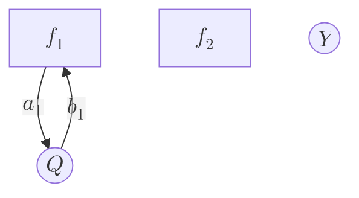

# Original sum-product algorithm

## Simple example Baysian network


```mermaid

graph TD
    Q((Q))
    Y((Y))

    Q-->Y
```

```math
P(Q, Y) = P(Q)P(Y|Q)
```

### Factor graph representation


```mermaid

graph TD
    f1["$$ f_1 $$"]
    Q(($$ Q $$))
    f2[$$ f_2 $$]
    Y(($$ Y $$))
    
    f1--"$$ a_1 $$"-->Q
    Q-->|"$$ b_1 $$"| f1
    
    

```

```mermaid
info
```