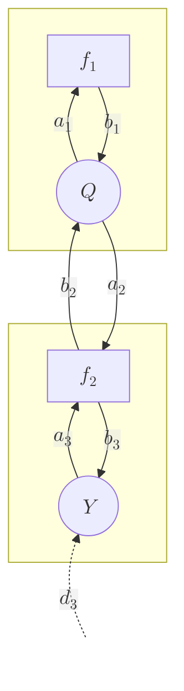

# Original sum-product algorithm

## Simple example Baysian network

First consider a simple Bayesian network, in which there is one hidden variable $Q$ and one observed variable $Y$.


Then the complete probability distribution over all variables can be factorized as follows:

```math
P(Q, Y) = P(Q)P(Y|Q)
```

### Factor graph representation

A Bayesian network can be converted into a factor graph representation as follows:
1. For each node in the Bayesian network, place one corresponding *variable node*.
2. For each probability distribution associated with the nodes, place one corresponding *factor node*.
3. For each factor node, draw links to and from all variable nodes that are included in its probability distribution.
4. Draw one evidence link into each observed variable node.

For example, for the above network:
1. Place one variable node for $Q$ and one for $Y$.
2. There are two probability distributions, namely $P(Q)$ and $P(Y|Q)$. For each, place the corresponding factor nodes $f_1$ and $f_2$.
3. First consider the factor node $f_1$. Its corresponding distribution $P(Q)$ only takes $Q$ as an input. Hence place links to and from the corresponding variable node for $Q$ ($a_1$ and $b_1$). Then consider the factor node $f_2$, with corresponding probability distribution $P(Y|Q)$. This distribution takes both $Q$ and $Y$ as inputs, so draw links to and from to those two variable nodes ($b_2$ and $a_2$, $a_3$ and $b_3$).
4. Finally, draw an evidence link into the observed variable node $Y$.



Note how I labeled each link going into a factor node $a$ and each link going into a variable node $b$. The evidence links are labeled with the letter $d$.

Furthermore, note that by the above procedure there is always one and exactly one variable node and factor node for each node in the original Bayesian network. These two may be considered each other's *local* factor/variable node. For example, factor node $f_1$ is variable node $Q$'s local factor node and, vice versa, $Q$ is $f_1$'s local variable node. Furthermore, their links can be called *local* links. Thus, $a_1$ and $b_1$ are local links. Conversely, links between nodes stemming from different nodes in the original Bayesian network may be called *remote* links. For example, $a_2$ and $b_2$ are remote links.

Using the factor graph, the complete probability distribution is calculated as the product of the factor nodes:

```math
P(Q, Y) = f_1(q)f_2(q, y)
```

where

```math
f_1(q) = P(Q) \\
f_2(q, y) = P(Y|Q)
```

### Message definitions

