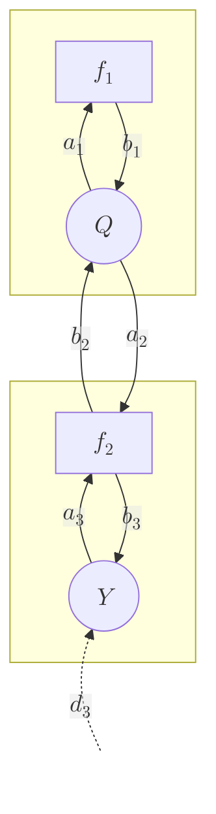
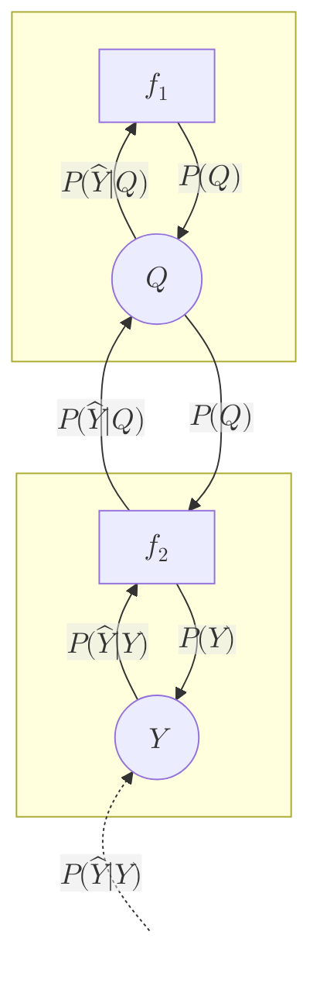
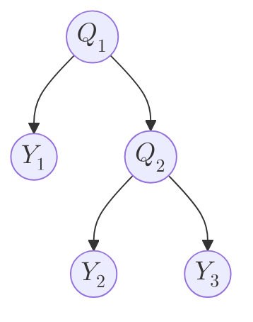
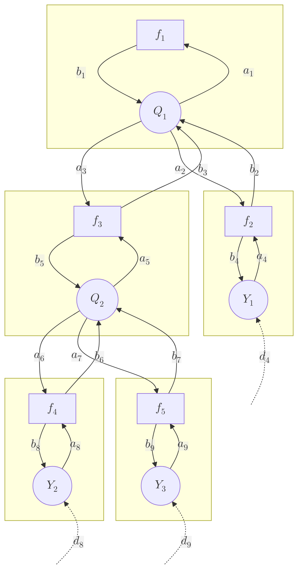
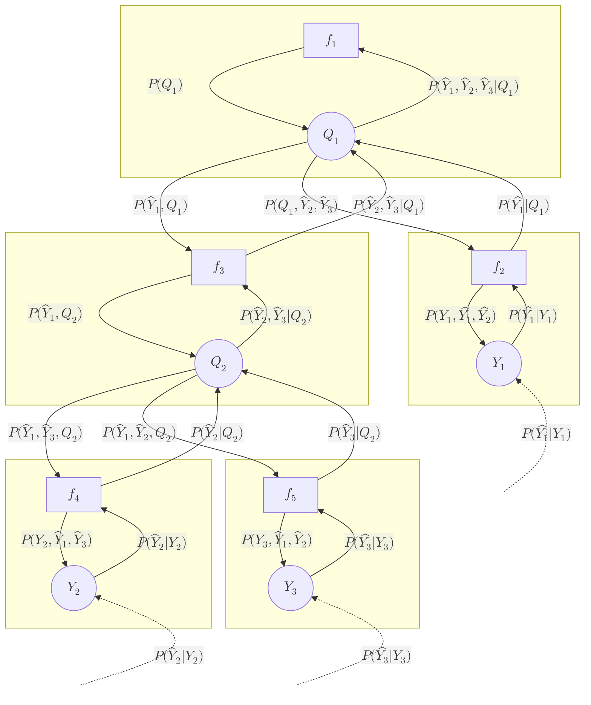

[TOC]

# Simple example Bayesian network

Consider a simple Bayesian network, in which there is one hidden variable $Q$ and one observed variable $Y$.


Then the complete probability distribution over all variables can be factorized as follows:

```math
P(Q, Y) = P(Q)P(Y|Q)
```

Suppose the network has the following parameters.

$P(Q)$ is described by a two-label conditional probability table (CPT):

| q   | P(Q = q) |
| --- | -------- |
| 0   | 0.4      |
| 1   | 0.6      |

$P(Y|Q)$ is described by a CPT where $Y$ takes on three possible values:

| y   | P(Y = y &#124; Q = 0) | P(Y = y &#124; Q = 1) |
| --- | --------------------- | --------------------- |
| 0   | 0.1                   | 0.5                   |
| 1   | 0.6                   | 0.1                   |
| 2   | 0.3                   | 0.4                   |

## Naive inference

Now let's perform inference on the hidden variable $Q$ for each of the three possible observations.

The posterior distribution is calculated as:

```math

P(Q|Y) = \frac{P(Y|Q)P(Q)}{P(Y)} = \frac{P(Y|Q)P(Q)}{\sum\limits_{q}{P(Y|Q)P(Q)}}

```

### Python example
```python
import numpy as np

# Define CPTs
P_Q = np.array([0.4, 0.6])
P_YxQ = np.array([[0.1, 0.6, 0.3], [0.5, 0.1, 0.4]])

# Calculate unnormalized
P_QxY = (P_YxQ * P_Q[:, None]).T

# Normalize
P_Y = P_QxY.sum(axis=1)
P_QxY /= P_Y[:, None]

# Print
P_QxY
```

Output:
```
array([[0.11764706, 0.88235294],
       [0.8       , 0.2       ],
       [0.33333333, 0.66666667]])
```

## Sum-product algorithm

### Factor graph representation

A Bayesian network can be converted into a factor graph representation as follows:
1. For each node in the Bayesian network, place one corresponding *variable node*.
2. For each probability distribution associated with the nodes, place one corresponding *factor node*.
3. For each factor node, draw links to and from all variable nodes that are included in its probability distribution.
4. Draw one evidence link into each observed variable node.

For example, for the above network:
1. Place one variable node for $Q$ and one for $Y$.
2. There are two probability distributions, namely $P(Q)$ and $P(Y|Q)$. For each, place the corresponding factor nodes $f_1$ and $f_2$.
3. First consider the factor node $f_1$. Its corresponding distribution $P(Q)$ only takes $Q$ as an input. Hence place links to and from the corresponding variable node for $Q$ ($a_1$ and $b_1$). Then consider the factor node $f_2$, with corresponding probability distribution $P(Y|Q)$. This distribution takes both $Q$ and $Y$ as inputs, so draw links to and from to those two variable nodes ($b_2$ and $a_2$, $a_3$ and $b_3$).
4. Finally, draw an evidence link into the observed variable node $Y$.



Note that each link going into a factor node is labeled $a$ and each link going into a variable node is labeled $b$. The evidence links are labeled with the letter $d$.

Furthermore, note that by the above procedure there is always one and exactly one variable node and factor node for each node in the original Bayesian network. These two may be considered each other's *local* factor/variable node. For example, factor node $f_1$ is variable node $Q$'s local factor node and, vice versa, $Q$ is $f_1$'s local variable node. Furthermore, their links can be called *local* links. Thus, $a_1$ and $b_1$ are local links. Conversely, links between nodes stemming from different nodes in the original Bayesian network may be called *remote* links. For example, $a_2$ and $b_2$ are remote links.

Using the factor graph, the complete probability distribution is calculated as the product of the factor nodes:

```math
P(Q, Y) = f_1(q)f_2(q, y)
```

where

```math
f_1(q) = P(Q) \\
f_2(q, y) = P(Y|Q)
```

### Message definitions

```math

\begin{align}

d_3(y) & = 
    P(\hat{Y}|Y)
    \qquad \qquad \qquad \qquad \qquad \qquad \qquad 
    & \begin{cases}
        1 & \text{if } y = \hat{y} \\
        0 & \text{if } y \ne \hat{y} \\
    \end{cases} \\
a_3(y) & = 
    d_3(y)
    & P(\hat{Y}|Y) \\
b_3(y) & =
    \sum_{q}{f_2(q, y)a_2(q)} 
    = \sum_{q}{P(Y|Q)P(Q)}
    & P(Y) \\
b_2(q) & =
    \sum_{q}{f_2(q, y)a_3(q)} 
    = \sum_{q}{P(Y|Q)P(\hat{Y}|Y)}
    & P(\hat{Y}|Q) \\
a_2(q) & = 
    b_1(q)
    & P(Q) \\
a_1(q) & = 
    b_2(q)
    & P(\hat{Y}|Q) \\
b_1(q) & = 
    f_1(q)
    & P(Q) \\
        

\end{align}

```

Plotted on the graph:



### Inference

Since most messages depend on other message, a number of iterations is needed to calculate the final values for all messages (in this case 4 iterations: $d_3$→$a_3$→$b_2$→$a_2$→$b_3$).

After that, the messages can be used to perform inference on the hidden variable $Q$:

```math

a_1(q)b_1(q) = P(\hat{Y}|Q)P(Q)

```

Normalizing yields the posterior distribution for $Q$:

```math

P(Q|\hat{Y}) = \frac{P(\hat{Y}|Q)P(Q)}{P(\hat{Y})} 
     = \frac{P(\hat{Y}|Q)P(Q)}{\sum\limits_{q}{P(\hat{Y}|Q)P(Q)}} 
    =  \frac{a_1(q)b_1(q)}{\sum\limits_{q}{a_1(q)b_1(q)}}

```

### Python example

```python
P_QxY = np.zeros((3, 2))

# For each possible input value
for Y_hat in [0, 1, 2]:
    # Messages upwards
    d3 = (np.arange(3) == Y_hat).astype(float)
    a3 = d3
    b2 = (P_YxQ * a3[None, :]).sum(axis=1)
    a1 = b2

    # Messages downwards
    b1 = P_Q
    a2 = b1
    b3 = (P_YxQ * a2[:, None]).sum(axis=0)
    
    # Calculate P_Q
    P_QxY[Y_hat, :] = a1 * b1 / (a1 * b1).sum()
    
P_QxY
```

Output:
```
array([[0.11764706, 0.88235294],
       [0.8       , 0.2       ],
       [0.33333333, 0.66666667]])
```

These values match with the ones calculated naively, showing the correctness of the algorithm.

# Complex Bayesian Network example

A more complex Bayesian network is given as follows:



## Naive inference

The simplest way to perform the posterior distributions $P(Q_1|Y_1,Y_2,Y_3)$ and $P(Q_2|Y_1,Y_2,Y_3)$ is to first calculate the complete joint probability distribution and marginalize and normalize appropriately.

The complete joint probability distribution is given by:

```math

P(Q_1,Q_2,Y_1,Y_2,Y_3) = P(Q_1)P(Y_1|Q_1)P(Q_2|Q_1)P(Y_2|Q_2)P(Y_3|Q_2)

```

Then:

```math

P(Q_1|Y_1,Y_2,Y_3) = \frac{\sum\limits_{q_2}{P(Q_1,Q_2,Y_1,Y_2,Y_3)}}{\sum\limits_{q_1}\sum\limits_{q_2}{P(Q_1,Q_2,Y_1,Y_2,Y_3)}}

\\

P(Q_2|Y_1,Y_2,Y_3) = \frac{\sum\limits_{q_1}{P(Q_1,Q_2,Y_1,Y_2,Y_3)}}{\sum\limits_{q_1}\sum\limits_{q_2}{P(Q_1,Q_2,Y_1,Y_2,Y_3)}}

```

### Python example
```python
import numpy as np

# Define CPTs
P_Q1 = np.array([0.4, 0.6])
P_Q2xQ1 = np.array([[0.3, 0.7], [0.2, 0.8]])
P_Y1xQ1 = np.array([[0.1, 0.6, 0.3], [0.5, 0.1, 0.4]])
P_Y2xQ2 = np.array([[0.5, 0.3, 0.2], [0.4, 0.2, 0.4]])
P_Y3xQ2 = np.array([[0.4, 0.6], [0.9, 0.1]])

# Define evidence
Y1_hat = np.array([0, 1, 0])
Y2_hat = np.array([0, 0, 1])
Y3_hat = np.array([1, 0])

# Calculate complete probability distribution
# [Q1, Q2, Y1, Y2, Y2]
P = P_Q1[:, None, None, None, None] \
    * P_Q2xQ1[:, :, None, None, None] \
    * P_Y1xQ1[:, None, :, None, None] \
    * P_Y2xQ2[None, :, None, :, None] \
    * P_Y3xQ2[None, :, None, None, :]

# Enter evidence my multiplying
P = P \
    * Y1_hat[None, None, :, None, None] \
    * Y2_hat[None, None, None, :, None] \
    * Y3_hat[None, None, None, None, :]

# Marginalize, unnormalized
P_Q1xY1_Y2_Y3 = P.sum(axis=(1, 2, 3, 4))
P_Q2xY1_Y2_Y3 = P.sum(axis=(0, 2, 3, 4))

# Normalize
P_Q1xY1_Y2_Y3 = P_Q1xY1_Y2_Y3 / P_Q1xY1_Y2_Y3.sum()
P_Q2xY1_Y2_Y3 = P_Q2xY1_Y2_Y3 / P_Q2xY1_Y2_Y3.sum()

# Print
print(P_Q1xY1_Y2_Y3)
print(P_Q2xY1_Y2_Y3)
```

Output:
```
[0.78409091 0.21590909]
[0.07954545 0.92045455]
```

## Sum-product algorithm

### Factor graph representation



### Message definitions

```math

\begin{align}

d_8(y_2) & = 
    \begin{cases}
        1 & \text{if } y_2 = \hat{y}_2 \\
        0 & \text{if } y_2 \ne \hat{y}_2 \\
    \end{cases}
    \qquad \qquad \qquad \qquad \qquad \qquad \qquad \qquad \qquad \qquad \qquad 
    & P(\hat{Y}_2|Y_2) \\

a_8(y_2) & = 
    d_8(y_2)
    & P(\hat{Y}_2|Y_2) \\

b_8(y_2) & =
    \sum_{q_2}{f_4(q_2, y_2)a_6(q_2)}
    = \sum_{q_2}{P(Y_2|Q_2)P(\hat{Y}_1,\hat{Y}_3,Q_2)}
    & P(Y_2, \hat{Y}_1,\hat{Y}_3) \\

b_6(y_2) & =
    \sum_{y_2}{f_4(y_2, q_2)a_8(y_2)}
    \sum_{y_2}{P(Y_2|Q_2)P(\hat{Y}_2|Y_2)}
    & P(\hat{Y}_2|Q_2) \\

a_6(q_2) & = 
    b_5(q_2)b_7(q_2)
    = P(\hat{Y}_1,Q_2)P(\hat{Y}_3|Q_2)
    & P(\hat{Y}_1,\hat{Y}_3,Q_2) \\

d_9(y_3) & = 
    \begin{cases}
        1 & \text{if } y_3 = \hat{y_3} \\
        0 & \text{if } y_3 \ne \hat{y_3} \\
    \end{cases}
    & P(\hat{Y_3}|Y_3) \\

a_9(y_3) & = 
    d_9(y_3)
    & P(\hat{Y_3}|Y_3) \\
    
b_9(y_3) & =
    \sum_{q_2}{f_5(q_2, y_3)a_7(q_2)}
    = \sum_{q_2}{P(Y_3|Q_2)P(\hat{Y}_1,\hat{Y}_2,Q_2)}
    & P(Y_3, \hat{Y}_1,\hat{Y}_2) \\

a_7(q_2) & = 
    b_5(q_2)b_6(q_2)
    = P(\hat{Y}_1,Q_2)P(\hat{Y}_2|Q_2)
    & P(\hat{Y}_1,\hat{Y}_2,Q_2) \\

b_7(y_3) & =
    \sum_{y_3}{f_5(y_3, q_2)a_9(y_3)}
    \sum_{y_3}{P(Y_3|Q_2)P(\hat{Y}_3|Y_3)}
    & P(\hat{Y}_3|Q_2) \\

a_5(q_2) & = 
    b_6(q_2)b_7(q_2)
    = P(\hat{Y}_2|Q_2)P(\hat{Y}_3|Q_2)
    & P(\hat{Y}_2,\hat{Y}_3|Q_2) \\

b_5(q_2) & =
    \sum_{q_1}{f_3(q_1, q_2)a_3(q_1)} 
    = \sum_{q_1}P(Q_2|Q_1)P(\hat{Y}_1, Q_1)
    & P(\hat{Y}_1, Q_2) \\

a_3(q_2) & = 
    b_1(q_1)b_2(q_1) 
    = P(Q_1)P(\hat{Y}_1|Q_1)
    & P(\hat{Y}_1, Q_1) \\

b_3(q_1) & =
    \sum_{q_2}{f_3(q_1, q_2)a_5(q_2)}
    = \sum_{q_2}{P(Q_2|Q_1)P(\hat{Y}_2,\hat{Y}_3|Q_2)} 
    & P(\hat{Y}_2,\hat{Y}_3|Q_1) \\

d_4(y_1) & = 
    \begin{cases}
        1 & \text{if } y_1 = \hat{y_1} \\
        0 & \text{if } y_1 \ne \hat{y_1} \\
    \end{cases}
    & P(\hat{Y_1}|Y_1) \\
        
a_4(y_1) & = 
    d_4(y)
    & P(\hat{Y_1}|Y_1) \\
    
b_4(y_1) & =
    \sum_{q_1}{f_2(q_1, y_1)a_2(q_1)} 
    = \sum_{q_1}{P(Y_1|Q_1)P(\hat{Y}_1,\hat{Y}_2,Q_1)} 
    & P(Y_1,\hat{Y_1},\hat{Y_2}) \\
    
b_2(q_1) & =
    \sum_{y_1}{f_2(q_1, y_1)a_4(q_1)}
    = \sum_{y_1}{P(Y_1|Q_1)P(\hat{Y_1}|Y_1)} 
    & P(\hat{Y_1}|Q_1) \\

a_2(q_1) & = 
    b_1(q_1)b_3(q_1)
    = P(Q_1)P(\hat{Y}_2,\hat{Y}_3|Q_1)
    & P(Q_1,\hat{Y}_2,\hat{Y}_3) \\
    
a_1(q_1) & = 
    b_2(q_1)b_3(q_1)
    = P(\hat{Y_1}|Q_1)P(\hat{Y}_2,\hat{Y}_3|Q_1)
    & P(\hat{Y}_1,\hat{Y}_2,\hat{Y}_3|Q_1) \\
    
b_1(q_1) & = 
    f_1(q_1)
    & P(Q_1) \\
        

\end{align}

```

Plotted on the graph:



### Inference

```math

\begin{align}

P(Q_1|\hat{Y}_1,\hat{Y}_2,\hat{Y}_3) 
    = & \frac{P(\hat{Y}_1,\hat{Y}_2,\hat{Y}_3|Q_1)P(Q_1)}{P(\hat{Y}_1,\hat{Y}_2,\hat{Y}_3)} \\
    = & \frac{P(\hat{Y}_1,\hat{Y}_2,\hat{Y}_3|Q_1)P(Q_1)}{\sum\limits_{q_1}{P(\hat{Y}_1,\hat{Y}_2,\hat{Y}_3|Q_1)P(Q_1)}} \\
    = & \frac{a_1(q_1)b_1(q_1)}{\sum\limits_{q_1}{a_1(q_1)b_1(q_1)}} \\

P(Q_2|\hat{Y}_1,\hat{Y}_2,\hat{Y}_3) 
    = & \frac{P(\hat{Y}_1,\hat{Y}_2,\hat{Y}_3|Q_2)P(Q_2)}{P(\hat{Y}_1,\hat{Y}_2,\hat{Y}_3)}  \\
    = & \frac{P(\hat{Y}_1,\hat{Y}_2,\hat{Y}_3,Q_2)}{\sum\limits_{q_2}{P(\hat{Y}_1,\hat{Y}_2,\hat{Y}_3,Q_2)}}  \\
    = & \frac{P(\hat{Y}_2,\hat{Y}_3|Q_2)P(\hat{Y}_1, Q_2)}{\sum\limits_{q_2}P(\hat{Y}_2,\hat{Y}_3|Q_2)P(\hat{Y}_1, Q_2)} \\
    = & \frac{a_5(q_2)b_5(q_2)}{\sum\limits_{q_2}{a_5(q_2)b_5(q_2)}} \\
    
\end{align}

```

### Python example

```python
import numpy as np

# Define CPTs
P_Q1 = np.array([0.4, 0.6])
P_Q2xQ1 = np.array([[0.3, 0.7], [0.2, 0.8]])
P_Y1xQ1 = np.array([[0.1, 0.6, 0.3], [0.5, 0.1, 0.4]])
P_Y2xQ2 = np.array([[0.5, 0.3, 0.2], [0.4, 0.2, 0.4]])
P_Y3xQ2 = np.array([[0.4, 0.6], [0.9, 0.1]])

# Define evidence
Y1_hat = np.array([0, 1, 0])
Y2_hat = np.array([0, 0, 1])
Y3_hat = np.array([1, 0])

# Calculate upwards messages
d8 = Y2_hat
a8 = d8
b6 = (a8[None, :]*P_Y2xQ2).sum(axis=1)

d9 = Y3_hat
a9 = d9
b7 = (a9[None, :]*P_Y3xQ2).sum(axis=1)

a5 = b6*b7
b3 = (a5[None, :]*P_Q2xQ1).sum(axis=1)

d4 = Y1_hat
a4 = d4
b2 = (a4[None, :]*P_Y1xQ1).sum(axis=1)

a1 = b2*b3

# Calculate downwards messages
b1 = P_Q1

a2 = b1*b3
b4 = (a2[:, None] * P_Y1xQ1).sum(axis=0)

a3 = b1*b2
b5 = (a3[:, None] * P_Q2xQ1).sum(axis=0)

a6 = b5*b7
b8 = (a6[:, None] * P_Y2xQ2).sum(axis=0)

a7 = b5*b6
b7 = (a7[:, None] * P_Y3xQ2).sum(axis=0)

# Inference
P_Q1xY1_Y2_Y3 = a1*b1
P_Q1xY1_Y2_Y3 = P_Q1xY1_Y2_Y3 / P_Q1xY1_Y2_Y3.sum()

P_Q2xY1_Y2_Y3 = a5*b5
P_Q2xY1_Y2_Y3 = P_Q2xY1_Y2_Y3 / P_Q2xY1_Y2_Y3.sum()

# Print
print(P_Q1xY1_Y2_Y3)
print(P_Q2xY1_Y2_Y3)
```

Output:
```
[0.78409091 0.21590909]
[0.07954545 0.92045455]
```
