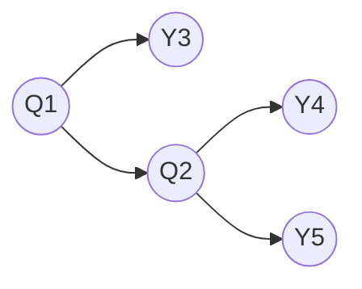
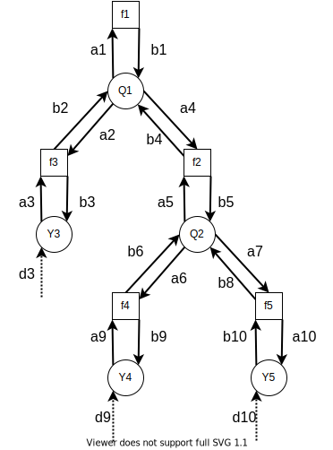

# Torch sum-product algorithm inference machine

## Modified sum-product algorithm

The original sum-product algorithm has the tendency that messages may vanish to zero after multiple iterations. This is especially problematic for factor graphs with loops (i.e. loopy belief propagation). I made a few modifications that keep the messages normalized within bounds. In addition, the normalized messages as well as normalization values now have meaningful interpretations.

### Example Bayesian network



```math
P(Q_1, Q_2, Y_1, Y_2, Y_3) = \\
    P(Q_1)P(Q2|Q1)P(Y1|Q1)P(Y2|Q2)P(Y3|Q2)
```

### Corresponding factor graph



```math
\begin{align}
    f_1(q_1) & = P(Q_1) \\
    f_2(q_1, q_2) & = P(Q_2 | Q_1) \\
    f_3(q_1, y_3) & = P(Y_3 | Q_1) \\
    f_4(q_2, y_4) & = P(Y_4 | Q_2) \\
    f_5(q_2, y_5) & = P(Y_5 | Q_2) \\
\end{align}
```

### Original sum-product algorithm

```math
P(Q_1, Q_2, Y_3, Y_4, Y_5) = \\
    f_1(q_1) f_2(q_1, q_2) f_3(q_1, y_3) f_4(q_2, y_4) f_5(q_2, y_5)
```

```math
\begin{align}
    d_3(y_3) & =
        I(y_3, \hat{y}_3) =
        \begin{cases}
            1 & \text{if } y_3 = \hat{y}_3 \\
            0 & \text{if } y_3 \ne \hat{y}_3 \\
        \end{cases} \\

    a_3(Y_3) & = \sum_{y_3} P(Y_3 | Q_1) \cdot a_3(y_3) & P
    (\hat{Y}_1 | Q_2) \\
    
    b_2(Q_1) & = 


\end{align}
```
